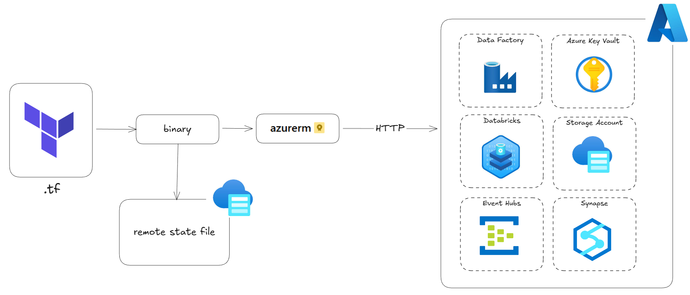

# Azure Data Platform with Terraform
This project provides a complete Infrastructure-as-Code (IaC) setup for deploying a comprehensive Azure data platform using Terraform. It includes multiple data services and follows best practices for modularity, maintainability, and environment management.

<div align="center">
  
</div>

## Project Structure
```bash
azure-data-platform-terraform/
├── main.tf                          # Root module configuration
├── provider.tf                      # Azure provider setup
├── variables.tf                     # Root module variables
├── outputs.tf                       # Root module outputs
├── terraform.tfvars                 # Default values (template)
├── backend.tf                       # Remote state configuration
├── modules/                         # Reusable modules
│   ├── storage_account_datalake/    # Data Lake Storage Gen2
│   ├── databricks/                  # Databricks workspace
│   ├── data_factory/                # Azure Data Factory
│   ├── key_vault/                   # Azure Key Vault
│   ├── event_hub/                   # Event Hub namespace & hubs
│   └── synapse/                     # Synapse Analytics workspace
└── envs/                            # Environment-specific configs
    ├── dev/                         # Development environment
    ├── staging/                     # Staging environment
    └── prod/                        # Production environment
```

## Components
### Storage Account (Data Lake)
- **Purpose**: Hierarchical namespace storage for data ingestion and processing
- **Features**: LRS replication, private containers, network rules
- **Containers**: Raw, Silver, Bronze, Gold

### Key Vault
- **Purpose**: Secure storage for secrets, keys, and certificates
- **Features**: Soft delete, purge protection, access policies
- **Integration**: Used by Data Factory and Synapse for credential management

### Event Hub
- **Purpose**: High-throughput event streaming and ingestion
- **Features**: Multiple event hubs, authorization rules, partitioning
- **Use Cases**: Real-time data ingestion, telemetry, monitoring

### Data Factory
- **Purpose**: Data orchestration and ETL pipeline execution
- **Features**: Linked services for storage and Key Vault, managed identity
- **Integration**: Connects to storage accounts and other data services

### Databricks
- **Purpose**: Collaborative Apache Spark analytics and ML
- **Features**: Premium tier workspace, managed cluster
- **Integration**: Integrates with storage accounts and Data Factory

### Synapse Analytics
- **Purpose**: Enterprise data warehouse and analytics
- **Features**: SQL pools, Spark pools, integrated analytics
- **Pools**: 
  - SQL Pool (DW100c with auto-scaling)
  - Spark Pool (MemoryOptimized with auto-pause)

## Prerequisites
1. Azure Account with active subscription
2. Terraform >= 1.0 installed
3. Azure CLI installed and authenticated
4. Required permissions:
   - Subscription Owner or Contributor role
   - Azure AD permissions for creating service principals

## Setup Instructions
### 1. Get Your Azure Information
```bash
# Get subscription ID
az account show --query id

az account show --query "{Name:name, SubscriptionId:id}"

# Get tenant ID
az account show --query tenantId

# Get your object ID
az ad signed-in-user show --query id
```

### 2. Configure Backend State
First, create a storage account for Terraform state:
```bash
# Create resource group
az group create -n tfstate-rg -l eastus

# Create storage account
az storage account create -n tfstate147 -g tfstate-rg -l eastus --sku Standard_LRS

# Create container
az storage container create -n tfstate --account-name tfstate147
```

### 3. Initialize Terraform
```bash
cd terraform-azure-data-platform

# For development
terraform init -backend-config="resource_group_name=tfstate-rg" \
               -backend-config="storage_account_name=tfstate147" \
               -backend-config="container_name=tfstate" \
               -backend-config="key=dev.terraform.tfstate"

# Or copy environment-specific values to backend.tf
```

### 4. Update Configuration
Update `terraform.tfvars` or environment-specific files:
```bash
# Copy dev environment config
cp envs/dev/terraform.tfvars dev.tfvars

# Edit with your values
nano dev.tfvars
```

Key values to update:
- `subscription_id`
- `tenant_id`
- `object_id`
- Resource names (must be globally unique for some resources)
- `synapse_sql_admin_password` (use strong password)

### 5. Deploy Infrastructure
```bash
# Validate configuration
terraform validate

# Plan changes
terraform plan -var-file="dev.tfvars" -out="dev.tfplan"

# Apply configuration
terraform apply dev.tfplan
```

## Environment-Specific Deployments

### Development Environment
```bash
terraform apply -var-file="envs/dev/terraform.tfvars"
```

### Staging Environment
```bash
terraform apply -var-file="envs/staging/terraform.tfvars"
```

### Production Environment
```bash
terraform apply -var-file="envs/prod/terraform.tfvars"
```

## Common Operations

### View Current State

```bash
terraform state list
terraform state show azurerm_resource_group.main
```

### Update a Specific Module

```bash
terraform apply -target=module.storage_account_datalake -var-file="dev.tfvars"
```

### Destroy All Resources
```bash
# Backup your state first
terraform state pull > backup.tfstate

# Destroy
terraform destroy -var-file="dev.tfvars"
```

### Destroy Specific Environment
```bash
# Only destroy dev environment
terraform destroy -var-file="envs/dev/terraform.tfvars"
```

## Monitoring and Logs
After deployment, set up monitoring:
```bash
# Create alert rules in Azure Portal for:
# - Storage account metrics
# - Event Hub throughput
# - Data Factory pipeline failures
# - Synapse query performance
```

